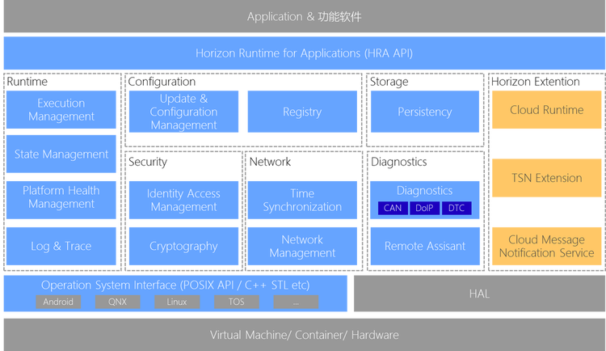

# Persistency

## 支持情况

| 平台和系统       | 编译器版本       | 支持情况 |
| ------------------ | ------------------ | ---------- |
| Ubuntu 18.04     | gcc 9.3.0        | 支持     |
| J5  & Linux 5.10 | gcc-linaro-9.3.0 | 支持     |

## 简述

### 功能简介

`SOC`上的进程在运行过程中会产生大量的数据，有些数据需要能够进行持久化的存储，以保证在系统断电、进程重启等异常情况下不会丢失和损坏。`Persistency`模块可以为系统提供稳定可靠的数据持久化存储能力，其它模块可以通过`Persistency`提供的接口实现键值数据和文件数据的持久化存储功能。

`Persistency`依赖`Logger`模块提供日志功能，依赖`hra::core`模块提供`Autosar AP`基础核心功能，依赖`OS(Posix)`提供操作系统底层功能，依赖`sqlite`提供数据库功能用于存储键值型数据，依赖`Json`文件及相关解析库实现配置存储功能。
`Persistency`对应用层提供用于进行键值型数据和文件数据的接口，`SM`、`EM`、`PHM`等进程可直接使用相关接口实现数据的持久化存储。

下图体现了`Persistency`在整个`boyan中间件`系统中的位置

### 技术实现

- 本设计要求运行环境支持文件系统并且有非易失存储介质。
- `Persistency`功能的开发基于`ubuntu 18.04`系统，依赖`C标准库`和`C++14`及以上标准库。
- `Persistency`的完整性检查功能依赖系统提供的加密和签名算法。
- `Persistency`的底层存储依赖操作系统提供的文件管理和数据库功能。

### 项目路标

待补充

## 相关文档

- [用户指南](./User-Guide.md)
- [API参考](../api/library_root.rst)

## 联系我们

- 官方网站：[地平线](https://www.horizon.ai/)

## 版权声明

- [Copyright (C) Horizon Robotics, Inc. - All Rights Reserved]()
- [模块中涉及的第三方服务及license许可]()
